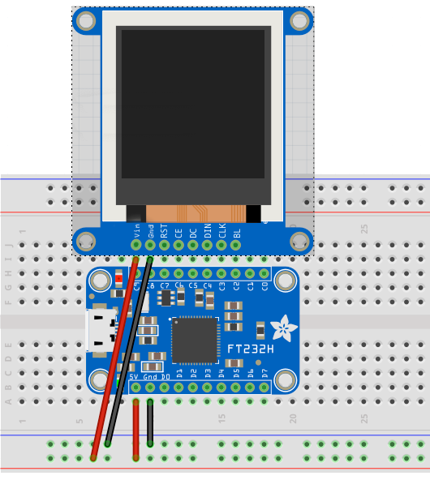

# FT232H-Mac #

This repo is dedicated to using [Adafruit’s FT232H Breakout](https://www.adafruit.com/product/2264) with a Mac.

Please see the blog post [*Mac NeoPixel notification light 2.0*](https://smittytone.wordpress.com/2020/03/07/mac-neopixel-notification) for how this kicked off.

## Installation ##

Run each of the following at the command line (macOS’ *Terminal*):

1. `brew install libusb`
2. `pip3 install pyftdi adafruit-blinka`
3. `echo 'export BLINKA_FT232H=1' >> ~/.bash_profile`

Now quit *Terminal* and the restart it to make use of the updated *bash* profile.

Connect a FT232H Breakout to one of your Mac’s USB ports. Depending on which version of the FT232H Breakout you have, you may need a USB adaptor. For example, the original version has a micro USB connector, so you may need to a USB-C to female USB-A adaptor to connect the required micro USB cable to a recent MacBook Pro or Air.

## Examples ##

This repo contains a number of simple apps to try:

### I2C ###

The first set of examples make use of an [Adafruit 0.56-inch 4-digit, 7-segment LED display](http://www.adafruit.com/products/878) connected to the FT232H Breakout’s I&sup2;C pins. The display is driven by a separate library, `htk1633segment_circuitpython.py`, which is included here to make it easy to import. You can visit the library’s source repo [here](https://github.com/smittytone/HT16K33Segment-Python).

The last two examples, `cpu.py` and `network.py`, require *psutil*, installed using `pip3 install psutil`.

**Note** Don’t forget to connect pins D1 and D2 directly in addition to using D1 as the I2C SDA pin.

- [`countdown.py`](./i2c/countdown.py) — Count down from 9999 to 0.
- [`countup.py`](./i2c/countup.py) — Count up from 0 to 9999.
- [`cpu.py`](./i2c/cpu.py) — See your Mac’s processor utilization in real time.
- [`network.py`](./i2c/network.py) — See a count of received packets in real time (resets at 9999).<br />

The following example uses an [Adafruit MCP9808 temperature sensor breakout](https://www.adafruit.com/product/1782) along with the seven-segment LED. To make use of the sensor, you need to install its driver library as follows: `sudo pip3 install adafruit-circuitpython-mcp9808`. That done you can run the code to display the current ambient temperature on the LED.

- [`mcp9808.py`](./i2c/mcp9808.py) — Display atmospheric temperature readings.<br />

The following examples use an [Adafruit 128x32 OLED](https://www.adafruit.com/product/931) panel connected to the FT232H Breakout’s I&sup2;C pins. The display is driven by a separate library, `ssd1306_circuitpython.py`, which is included here to make it easy to import. `macinfo.py` also requires *psutil*, installed using `pip3 install psutil`.

- [`macinfo.py`](./i2c/macinfo.py) — See a selection of Mac system info in real time.
- [`boxes.py`](./i2c/boxes.py) — Draw random boxes on the screen.
- [`eyes.py`](./i2c/macinfo.py) — Draw a pair of animated eyes. Watch them blink! See their mood change!<br />

### SPI ###

There’s a separate example of using SPI with a single NeoPixel [here](https://github.com/smittytone/TaskLight).


### GPIO ###

- [`gpio_flash.py`](./gpio/gpio_flash.py) — A very simple LED flasher; requires a single-colour LED.
- [`button.py`](./gpio/gpio_flash.py) — Use a physical button to trigger an action on your computer.<br />
- [`nokia.py`](./gpio/nokia.py) — A demo app for the Nokia 5110 display. There are a number of products from Adafruit, Sparkfun and others that provide this display. The code is configured for mine; you may need to adjust the pins passed into the class constructor for whichever version you have. The display is driven by a separate library, `nokia5110_circuitpython.py`, which is included here to make it easy to import.<br />

### UART ###

The FT232H Breakout provides UART through pins D0 (TX) and D1 (RX). The serial port is accessed as a Unix files in the `/dev` directory not through the Adafruit libraries which you call to access I2C, SPI and GPIO.

To find your device when it’s connected enter:

```
ls /dev/cu*
```

You’ll see something like:

```
crw-rw-rw- 1 root wheel 18,  3 Mar  4 09:40 /dev/cu.Bluetooth-Incoming-Port
crw-rw-rw- 1 root wheel 18,  5 Mar  4 09:40 /dev/cu.TSAirPods-WirelessiAP
crw-rw-rw- 1 root wheel 18, 17 Mar  4 17:10 /dev/cu.usbserial-1470
```

The entry `/dev/cu.usbserial-xxxx` is your FT232H Breakout as a serial port.

You can now run *screen* to view the data coming in on the UART:

```
screen /dev/cu.usbserial-1470 9600
```

You can also control the UART via Python using the [PySerial](https://pyserial.readthedocs.io/en/latest/index.html) module. Install PySerial using:

```
pip install pyserial
```

And then you can run code as follows:

```python
import serial
uart = serial.Serial("/dev/cu.usbserial-1470")  # open serial port
uart.write(b"Hello, world")                     # write a string
uart.close()                                    # close port
```